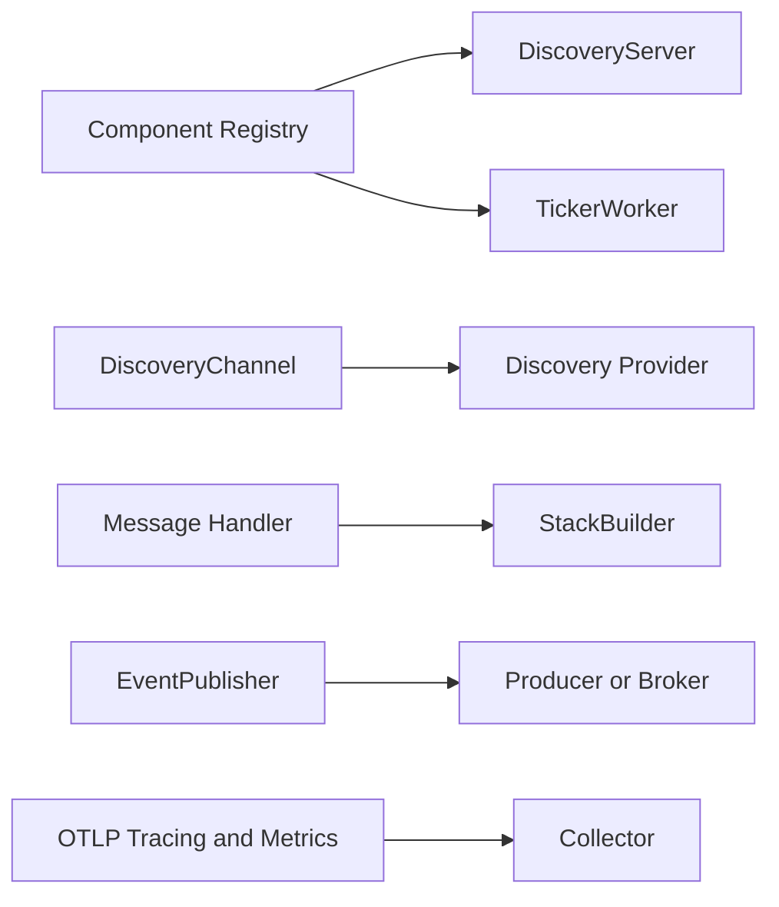

# pykit Integration Patterns
Use these patterns to combine pykit packages into service-level workflows.

## Quick reference

| Need | Packages | Start here |
|---|---|---|
| Register a running service in discovery | `pykit-discovery`, `pykit-component` | [Server + discovery](#pattern-1-server--discovery) |
| Wrap message handlers with reliability middleware | `pykit-messaging`, `pykit-resilience` | [Messaging + middleware stack](#pattern-2-messaging--middleware-stack) |
| Resolve gRPC targets through service discovery | `pykit-grpc`, `pykit-discovery` | [gRPC client + discovery](#pattern-3-grpc-client--discovery) |
| Export traces and metrics to an OTLP collector | `pykit-observability` | [Observability + OTLP](#pattern-4-observability--otlp) |
| Publish domain events without hand-building envelopes | `pykit-messaging` | [EventPublisher + messaging](#pattern-5-eventpublisher--messaging) |
| Run periodic background work under component lifecycle | `pykit-worker`, `pykit-component` | [TickerWorker + component registry](#pattern-6-tickerworker--component-registry) |

## How these pieces fit together



_A common composition keeps lifecycle management in the center, then attaches discovery, messaging, telemetry, and background work around it._

## Pattern 1: Server + discovery

**Use when:** you want a service to register on startup and deregister on shutdown.

`DiscoveryServer` wraps any component with `start()`, `stop()`, and `health()` methods. The example below uses `StaticProvider` so the flow stays local and easy to test. In a real deployment, swap in another discovery provider such as `ConsulProvider`.

```python
from pykit_component import Health, HealthStatus
from pykit_discovery import DiscoveryServer, ServiceInstance, StaticProvider


class ApiServer:
    name = "payments-api"

    async def start(self) -> None:
        pass

    async def stop(self) -> None:
        pass

    async def health(self) -> Health:
        return Health(name=self.name, status=HealthStatus.HEALTHY)


provider = StaticProvider()
instance = ServiceInstance(
    id="payments-1",
    name="payments",
    host="127.0.0.1",
    port=8080,
    tags=["v1", "dev"],
)

server = DiscoveryServer(server=ApiServer(), registry=provider, instance=instance)

await server.start()
instances = await provider.discover("payments")
await server.stop()
```

**Packages involved**

- `pykit-discovery` — `DiscoveryServer`, `ServiceInstance`, `StaticProvider`
- `pykit-component` — `Health`, `HealthStatus`

## Pattern 2: Messaging + middleware stack

**Use when:** you want retries, deduplication, metrics, and circuit breaking without hand-nesting wrappers.

`StackBuilder` applies middleware in a fixed order: `Metrics → Dedup → CircuitBreaker → Retry → Handler`.

```python
from pykit_messaging import (
    CircuitBreakerConfig,
    DedupConfig,
    FuncHandler,
    Message,
    NoopMetrics,
    RetryConfig,
    StackBuilder,
)


async def handle_order(msg: Message) -> None:
    print(msg.topic, msg.key)


handler = (
    StackBuilder(FuncHandler(handle_order))
    .with_retry(RetryConfig(max_attempts=3, initial_backoff=0.1))
    .with_metrics(NoopMetrics(), "orders.created")
    .with_dedup(DedupConfig(window_size=1000, ttl=60.0))
    .with_circuit_breaker(CircuitBreakerConfig(threshold=5, timeout=30.0))
    .build()
)

await handler.handle(
    Message(
        key="order-123",
        value=b'{"id":"order-123"}',
        topic="orders.created",
        partition=0,
        offset=1,
    )
)
```

**Packages involved**

- `pykit-messaging` — `StackBuilder`, `FuncHandler`, `Message`, middleware configs
- `pykit-resilience` — powers retry and circuit-breaker behavior under the hood

## Pattern 3: gRPC client + discovery

**Use when:** the client should resolve a service name instead of hardcoding an address.

`DiscoveryChannel` discovers a healthy instance, creates a `grpc.aio.Channel`, and can keep refreshing the target in the background.

```python
from pykit_discovery import ServiceInstance, StaticProvider
from pykit_grpc import DiscoveryChannel, GrpcConfig


provider = StaticProvider()
await provider.register(
    ServiceInstance(
        id="analysis-1",
        name="analysis-service",
        host="localhost",
        port=50051,
        protocol="grpc",
    )
)

config = GrpcConfig(insecure=True, timeout=30.0)

async with DiscoveryChannel(provider, "analysis-service", config) as channel:
    grpc_channel = channel.channel
    # stub = AnalysisServiceStub(grpc_channel)
    # response = await stub.Analyze(...)
    ready = await channel.ping()
```

**Packages involved**

- `pykit-grpc` — `DiscoveryChannel`, `GrpcConfig`
- `pykit-discovery` — `StaticProvider`, `ServiceInstance`

## Pattern 4: Observability + OTLP

**Use when:** you want to export traces and metrics to an OTLP collector.

The OTLP helpers return providers that own background exporter threads. Shut them down during application teardown.

```python
from pykit_observability import OtlpExporterConfig, setup_otlp_metrics, setup_otlp_tracing


config = OtlpExporterConfig(
    endpoint="http://localhost:4318",
    timeout=15.0,
)

tracer_provider = setup_otlp_tracing("order-service", config)
meter_provider = setup_otlp_metrics("order-service", config)

# ... run the application ...

tracer_provider.shutdown()
meter_provider.shutdown()
```

**Packages involved**

- `pykit-observability` — `OtlpExporterConfig`, `setup_otlp_tracing()`, `setup_otlp_metrics()`

## Pattern 5: EventPublisher + messaging

**Use when:** you want consistent event envelopes without rebuilding UUID, timestamp, and source fields every time.

`EventPublisher` works with any `MessageProducer`. The example uses `InMemoryBroker` because it is easy to test and does not require an external service.

```python
from pykit_messaging import EventPublisher, InMemoryBroker, wait_for_message


broker = InMemoryBroker()
producer = broker.producer()
publisher = EventPublisher(producer, source="order-service")

await publisher.publish(
    topic="orders.created",
    event_type="order.created.v1",
    data={"order_id": "order-123", "amount": 99.99},
)

msg = await wait_for_message(broker, "orders.created", timeout=1.0)
```

Swap the producer for an adapter-backed producer when you want Kafka, NATS, or RabbitMQ.

**Packages involved**

- `pykit-messaging` — `EventPublisher`, `InMemoryBroker`, `wait_for_message()`
- contrib adapters — `pykit-messaging-kafka`, `pykit-messaging-nats`, `pykit-messaging-rabbitmq`

## Pattern 6: TickerWorker + component registry

**Use when:** you need periodic background work that starts and stops with the rest of the service.

`TickerWorker` runs an async handler on a fixed interval. Register it in `pykit-component.Registry` when it should participate in the same lifecycle as the rest of the application.

```python
import asyncio

from pykit_component import Registry
from pykit_worker import TickerWorker


async def refresh_cache() -> None:
    pass


registry = Registry()
ticker = TickerWorker("cache-refresh", interval=30.0, handler=refresh_cache)
registry.register(ticker)

await registry.start_all()
await asyncio.sleep(65.0)
health = await ticker.health()
await registry.stop_all()
```

**Packages involved**

- `pykit-worker` — `TickerWorker`
- `pykit-component` — `Registry`

## Putting the patterns together

A typical service composition looks like this:

1. Wrap the main server component with `DiscoveryServer`.
2. Register background jobs such as `TickerWorker` in a shared `Registry`.
3. Use `DiscoveryChannel` for client-side service lookup.
4. Wrap consumers with `StackBuilder` so retry and failure handling are consistent.
5. Publish domain events through `EventPublisher`.
6. Initialize OTLP tracing and metrics early, then shut them down on exit.

## Best practices

- Start with in-memory or static implementations in tests and local examples.
- Prefer explicit lifecycle management over background globals.
- Keep adapter configuration at the composition boundary.
- Shut down OTLP providers and long-lived channels cleanly.
- Use middleware builders instead of hand-built wrapper chains when a package already provides the composition order.
