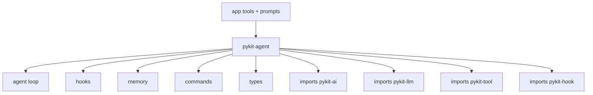

# pykit-agent

Bounded AI agent loop with canonical LLM stream events, observe-only hooks, and explicit budgets.

Defaults: `max_turns=10`, `max_tokens=100_000`, `wall_clock_seconds=60.0`, `max_tool_calls=50`, `tool_concurrency=4`, `tool_timeout_seconds=30.0`.

Hooks are async and observe-only: `on_start`, `on_llm_request`, `on_llm_response`, `on_tool_call`, `on_tool_result`, `on_mcp_request`, `on_mcp_result`, `on_step_complete`, `on_error`, `on_stop`.

## Architecture

