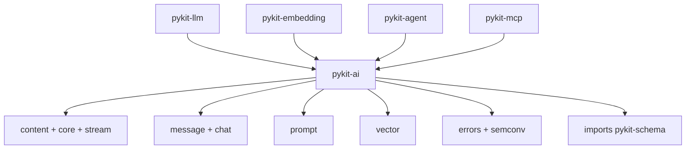

# pykit-ai

Canonical AI vocabulary for pykit AI/ML packages: content parts, messages, model identity, usage, budgets, stream events, prompts, vector helpers, typed exceptions, and OpenTelemetry semantic-convention keys.

This package contains shared types and utilities only: no providers, registries, I/O, or runtime logic.

## Architecture

