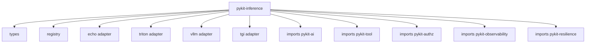

# pykit-inference

`pykit-inference` is the model-serving runtime adapter layer. It is for Triton, vLLM raw, TGI, KServe v2, BentoML, ONNX Runtime Server, TFServing, and custom REST/gRPC prediction endpoints. Chat completions and chat provider adapters live in `pykit-llm`.

## Adapter status

| Adapter | Protocol | Status |
|---|---|---|
| `echo` | In-memory echo | Implemented lean default |
| `triton` | KServe v2 HTTP `/v2/models/{name}/infer` | Implemented |
| `vllm` | vLLM raw serving | Implemented (OpenAI-compatible) |
| `tgi` | Hugging Face Text Generation Inference | Implemented (OpenAI-compatible) |
| `bentoml` | BentoML serving | Extra reserved |
| `kserve` | KServe v2 generic | Extra reserved |
| `tfserving` | TensorFlow Serving | Extra reserved |
| `onnx-rs` | ONNX Runtime Server | Extra reserved |

## Consumer wiring

```python
import httpx
from pykit_inference import Echo, PredictRequest, Tensor, Value, ValueKind
from pykit_inference.registry import Registry
from pykit_inference_triton import TritonInference, register as register_triton
from pykit_inference_triton.client import TritonConfig

registry = Registry()
register_triton(registry)

async with httpx.AsyncClient(base_url="http://triton:8000") as http:
    adapter = TritonInference(TritonConfig(base_url="http://triton:8000"), client=http)
    response = await adapter.predict(
        PredictRequest(
            model_name="classifier",
            inputs={
                "input": Value(
                    kind=ValueKind.TENSOR,
                    tensor=Tensor(dtype="FP32", shape=[1, 2], data=[0.25, 0.75]),
                )
            },
        )
    )
```


## Echo adapter

```python
from pykit_inference import Echo, PredictRequest, Value, ValueKind

adapter = Echo()
response = await adapter.predict(
    PredictRequest(model_name="echo", inputs={"text": Value(kind=ValueKind.TEXT, text="hello")})
)
assert response.outputs["text"].text == "hello"
```

Backends register explicitly with a caller-owned `Registry`; there is no module-level global registry and no import-time auto-registration. HTTP clients, resilience policies, observability, and authz deciders are injected at construction.

## Installation

```bash
uv add pykit-inference
```

Install standalone adapter packages such as `pykit-inference-triton`, `pykit-inference-vllm`, and `pykit-inference-tgi` for runtime-specific integrations.
Use `pykit-llm` for chat completion, tool-calling, and chat streaming providers.

## Architecture


