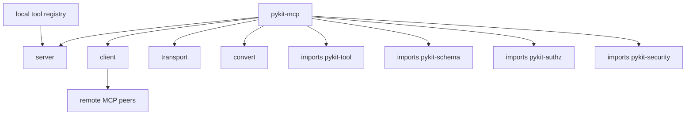

# pykit-mcp

Bridge the pykit tool registry with the [Model Context Protocol (MCP)](https://modelcontextprotocol.io/).

See [`CONFORMANCE.md`](./CONFORMANCE.md) for MCP 2025-06-18 conformance status.

## Installation

```bash
pip install pykit-mcp
```

## Quick start

```python
from pykit_mcp import create_server
from pykit_tool import Registry

registry = Registry()

server = create_server("my-service", "1.0.0", registry)
```

## Skill pack integration example

```python
from pykit_mcp import create_server
from pykit_skill import Loader
from pykit_tool import Registry

registry = Registry()
skill = Loader().load("./skills/database-inspector")

server = create_server(
    "my-service",
    "1.0.0",
    registry,
    allowed_tools=skill.manifest.references.tools,
)
```

## Skill discovery example

```python
from pathlib import Path

from pykit_skill import Loader

loader = Loader()
skills = [loader.load(path) for path in Path("./skills").iterdir() if path.is_dir()]
print(skills[0].manifest.name, skills[0].manifest.description)
```

## Streamable HTTP security example

```python
from pykit_mcp import create_streamable_http_security_settings

security = create_streamable_http_security_settings(
    allowed_origins=["https://app.example.com"],
)
```

## Features

- Converts `pykit-tool` definitions to MCP tool descriptors
- Uses `pykit-schema` for tool input/output validation
- Exposes canonical MCP transport names: `stdio` and `streamable_http`
- Supports prompts, resources, resource templates, and lightweight skill packs
- Includes Streamable HTTP security defaults for loopback-safe local servers

## Architecture


