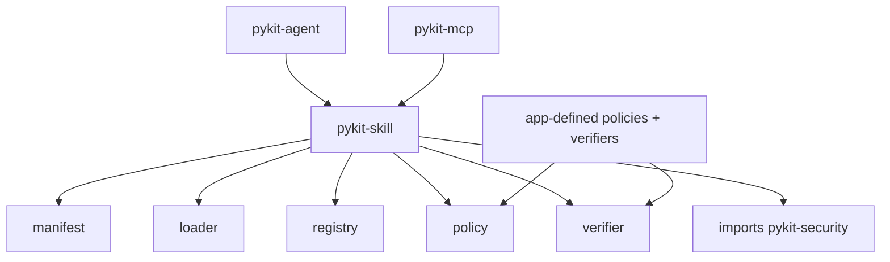

# pykit-skill

Load, validate, and register skill packs built from manifests, bodies, and verification policies.

> **Note:** This `skill` primitive borrows the `SKILL.md` filename and progressive-disclosure model from Anthropic Agent Skills. It is a distinct primitive and makes no interop claim with Claude Code or the Anthropic runtime.

## Installation

```bash
pip install pykit-skill
# or
uv add pykit-skill
```

## Quick start

```python
from pathlib import Path
from pykit_skill import InMemoryRegistry, Loader

loader = Loader()
pack = loader.load(Path("skills/release"))

registry = InMemoryRegistry()
registry.add(pack)

print(pack.manifest.name)
print(pack.body)
print(pack.scripts)
```

A skill pack directory uses `kit.skill.yaml` for metadata and `SKILL.md` for the progressive-disclosure body. Files under `scripts/` are treated as inert assets: the loader records their relative path and SHA-256 digest, but never executes them.

## Core concepts

- **`Manifest`** captures name, version, description, safety, references, budgets, model hints, human-approval rules, and progressive-disclosure text.
- **`Loader`** reads a pack from an explicit filesystem path and returns a `SkillPack` with the manifest, body, and discovered script assets.
- **`Provider`** and **`Registry`** are protocol seams for explicit skill registration.
- **`InMemoryRegistry`** is the default in-process registry.
- **`Verifier`**, **`WarnOnlyVerifier`**, and **`DenyVerifier`** define signature verification behavior.
- **`effective_safety()`** and **`effective_envelope()`** combine manifest metadata with declared tool envelopes and operator constraints.

## Architecture



## See also

- [Main pykit README](../../../README.md)
- [tests/](tests/)
