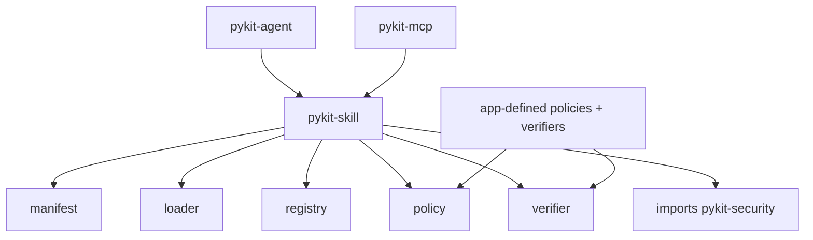

> **Note:** This `skill` primitive borrows the `SKILL.md` filename and progressive-disclosure model from Anthropic Agent Skills. It is a distinct primitive (capability bundle with intent + supervision) and makes **no interop claim** with Claude Code or the Anthropic runtime.

# pykit-skill

SDK-free skill manifests, loaders, registries, provider protocols, and verification seams.

The canonical pack metadata file is `kit.skill.yaml`. `scripts/` entries are inert assets: the loader records path and sha256 only and never executes them.

## Architecture

