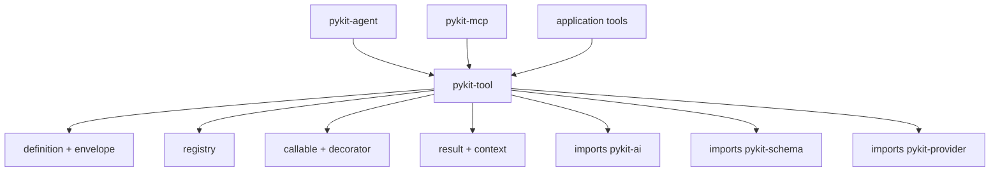

# pykit-tool

Tool definition, executable permission envelope, result conversion, and explicit registries for agentic systems.

## Key points

- `Definition.envelope` is the executable authority source (scopes, network, filesystem, subprocess, safety, sensitive invocations, data classification).
- `Annotations` carries only non-executable metadata; MCP safety hints are synthesized from the envelope at the wire boundary.
- Local logging/timeout/retry/metrics/validation middleware was removed. Compose std `logging`/`structlog`, `asyncio.wait_for`, `pykit-resilience`, `pykit-schema`, `pykit-security`, and `pykit-observability` at orchestration boundaries.
- `Registry.call_batch(..., BatchOptions(concurrency, fail_fast))` is caller-policy driven.

## Architecture

