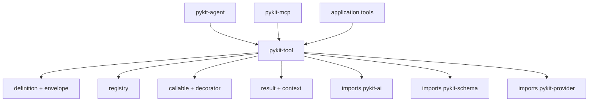

# pykit-tool

Define, validate, register, and execute tools with explicit permission envelopes for agentic systems.

## Installation

```bash
pip install pykit-tool
# or
uv add pykit-tool
```

## Quick start

```python
from pykit_tool import Context, Registry, tool

@tool(description="Echo a message")
async def echo(text: str) -> str:
    return text

registry = Registry()
await registry.start()
registry.register(echo.as_callable())

result = await registry.call("echo", Context(request_id="req-1"), {"text": "hello"})
print(result.text())
```

## Key ideas

- **`Definition.envelope`** is the executable authority source for scopes, network access, filesystem rules, subprocess rules, safety level, and sensitive-invocation handling.
- **`Annotations`** carries non-executable metadata only. MCP safety hints are synthesized from the envelope at the wire boundary.
- **`@tool()`** derives input schema from a typed function signature by calling `pykit-schema`.
- **`Registry.call_batch(..., BatchOptions(concurrency, fail_fast))`** keeps batch policy in the caller.
- Local logging, timeout, retry, metrics, and validation middleware is intentionally not built into this package. Compose `logging` or `structlog`, `asyncio.wait_for`, `pykit-resilience`, `pykit-schema`, `pykit-security`, and `pykit-observability` at orchestration boundaries.

## Core APIs

- **`Tool`** and **`Callable`** wrap typed handlers.
- **`Registry`** stores tools, searches definitions, applies sensitivity checks, and executes calls.
- **`Context`** carries request metadata and cancellation state.
- **`Result`**, **`text_result()`**, **`json_result()`**, and **`error_result()`** normalize tool outputs.
- **`SensitivityEvaluator`**, **`HumanApproval`**, and helper evaluators define escalation and approval behavior.
- **`Envelope`**, **`NetworkPolicy`**, **`FilesystemRule`**, and related models define execution constraints.

## Architecture



## See also

- [Main pykit README](../../../README.md)
- [tests/](tests/)
