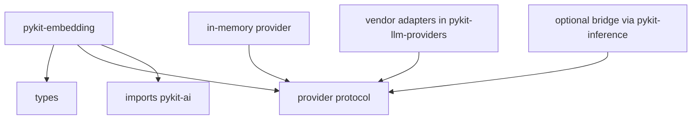

# pykit-embedding

Canonical embedding abstractions with multimodal inputs, model echo, usage accounting, distance metrics, and a deterministic in-memory adapter for tests.

## Installation

```bash
uv add pykit-embedding
```

## Quick start

```python
from pykit_ai import Model
from pykit_embedding import EmbedRequest, InMemoryProvider, Text

provider = InMemoryProvider(dimensions=4)
response = await provider.embed(
    EmbedRequest(model=Model(name="test-embedding"), inputs=[Text(text="hello")])
)
vector = response.embeddings[0].vector
```

## Provider placement

`pykit-embedding` owns only the abstraction and the lean deterministic in-memory adapter. Vendor backends live under `pykit-llm-providers` and opt in through explicit caller wiring. Self-hosted model-serving integration should bridge `pykit_embedding.Provider` to `pykit_inference.Inference` instead of duplicating Triton, vLLM, or TGI adapter code.

## Key components

- `Provider` — protocol with `embed(EmbedRequest)` and `embed_batch(list[EmbedRequest])`.
- `EmbedRequest` — `model`, multimodal `inputs`, and provider-specific `options`.
- `EmbedResponse` — `embeddings`, served `model`, and `pykit_ai.Usage`.
- `Embedding` — vector, dimensions, and zero-based input index.
- `Text`, `Image`, `Audio`, `Video` — discriminated input variants.
- `InMemoryProvider` — deterministic in-memory adapter for unit tests.

## Architecture


