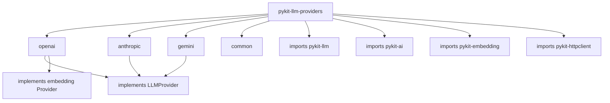

# pykit-llm-providers

LLM provider implementations (OpenAI, Anthropic, Gemini) for pykit.

## Installation

```bash
pip install pykit-llm-providers
# Install only the provider you need:
pip install pykit-llm-providers[openai]
pip install pykit-llm-providers[anthropic]
pip install pykit-llm-providers[gemini]
```

## Quick start

```python
from pykit_llm_providers import OpenAIProvider
from pykit_llm import LLMClient

provider = OpenAIProvider(api_key="sk-...")
client = LLMClient(provider=provider)

response = await client.complete("Explain async/await in Python in one paragraph.")
print(response.text)
```

## Features

- Unified `LLMProvider` interface for OpenAI, Anthropic, and Google Gemini
- Streaming support with async iterators
- Embedding generation via provider-native APIs
- Automatic retries and token-budget management via `pykit-resilience`
- Pluggable — swap providers without changing application code

## Architecture


